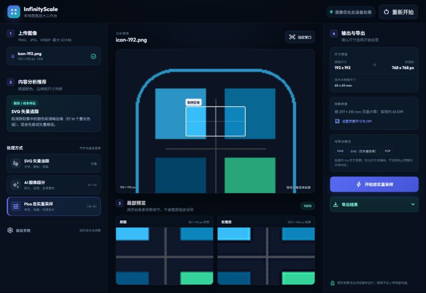

# InfinityScale

[](https://github.com/Github37525/infinityscale/actions/workflows/ci.yml)
[](LICENSE)

InfinityScale is a local-first browser workbench for image upscaling, vector tracing, print-size planning, and detail inspection. It keeps source-image pixels in the browser while offering three processing paths for different types of artwork.

**Live demo:** https://github37525.github.io/infinityscale/

**Project links:** [多语言介绍页 / Language landing page](https://github37525.github.io/infinityscale/intro/) · [Roadmap](ROADMAP.md) · [Issues](https://github.com/Github37525/infinityscale/issues) · [Discussions](https://github.com/Github37525/infinityscale/discussions)



## Why this project exists

Upscaling tools often present one algorithm as suitable for every image or imply that generated detail is lossless. InfinityScale instead makes the trade-off visible:

- **VTracer SVG** for logos, type, signatures, and line art.
- **ESRGAN Thick 2×/4×** for photographic material where reconstructed detail is acceptable.
- **Pica MKS2013** for faithful, deterministic resampling of gradients, illustrations, and already-clean source images.

The app analyzes color distribution, edge density, transparency, and source dimensions to recommend a starting method. Recommendations are deterministic, can be overridden, and never hide which algorithm will actually run.

## Features

- Drag, file-picker, and clipboard image input.
- Content-based processing recommendation with explicit manual override.
- Draggable sample region and synchronized local before/after preview.
- Stale-result invalidation whenever an algorithm or parameter changes.
- Consecutive processing without leaking model tensors or reusing old output.
- PNG, SVG, and print-layout PDF export.
- Output scale, linked pixel dimensions, target DPI, and effective-DPI feedback.
- Input and canvas safety limits for browser stability.
- Installable PWA shell with cache-aware offline fallback.
- Responsive desktop and mobile layouts.

## Privacy and network boundaries

InfinityScale does not upload the selected image to an application server. Processing and export happen inside the browser.

The first use is **not fully offline**: libraries, AI model weights, and the VTracer WebAssembly module are fetched from pinned public CDN URLs and may then be cached by the service worker. Browser, CDN, and network-provider policies still apply to those requests.

## Run locally

### Windows

Double-click `启动桌面服务.bat`.

### Any platform with Python

```bash
python -m http.server 8080
```

Open http://localhost:8080. A local HTTP server is recommended because service workers and PWA installation are unavailable from `file://` URLs.

## Browser limits

- Maximum input file: 50 MB.
- Maximum decoded input: 80 megapixels.
- Raster output is capped by conservative canvas side and pixel limits.
- AI inference may fall back to Pica when the requested output is unsafe for the current browser.
- SVG is a traced approximation; inspect paths and colors before production use.
- AI super-resolution reconstructs detail and is not pixel-faithful recovery.

## Development

No build step is required for the application itself.

```bash
node --check app.js
node --check sw.js
node tests/smoke.mjs
```

See [CONTRIBUTING.md](CONTRIBUTING.md) for contribution and verification rules.

## Third-party components

The runtime loads TensorFlow.js, UpscalerJS, ESRGAN Thick model definitions, Pica, VTracer WASM, jsPDF, Material Symbols, Outfit, and Noto Sans SC. See [THIRD_PARTY_NOTICES.md](THIRD_PARTY_NOTICES.md) for upstream projects and license references.

## License

InfinityScale source code is released under the [MIT License](LICENSE). Third-party components remain under their respective licenses.

---

## 中文简介

InfinityScale 是一个本地优先的浏览器图像工作台，提供 SVG 矢量追踪、ESRGAN Thick 2×/4× 超分、Pica MKS2013 忠实重采样、局部对比和印刷尺寸规划。

它不会把所选图片上传到应用服务器，但首次使用仍需从公共 CDN 获取运行库、模型权重和 WASM；AI 生成的细节也不应被称为“无损恢复”。
